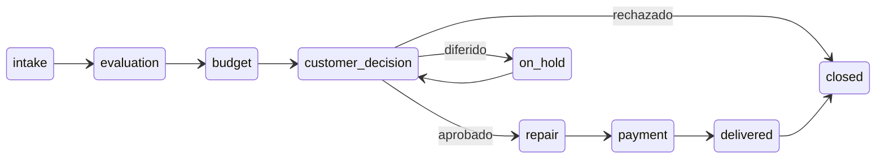
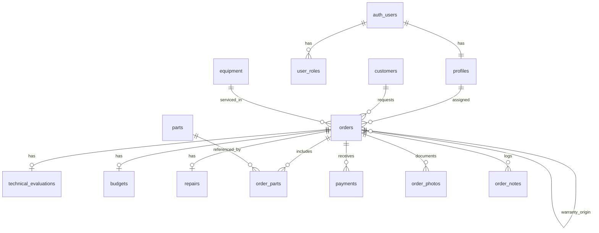
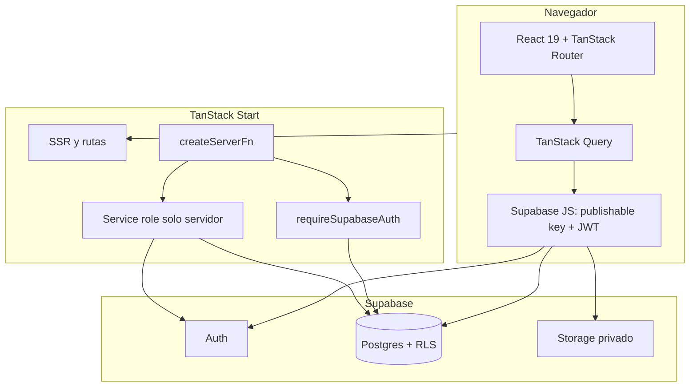

# Digitron App

Sistema web full-stack para gestionar el ciclo completo de las **órdenes de servicio técnico** de Digitron. Centraliza clientes, equipos, evaluaciones, presupuestos, reparaciones, inventario, pagos, fotografías, auditoría y reportes operativos.

- **Uso:** herramienta interna del taller; no hay autoservicio para clientes.
- **Idioma principal de la UI:** español, con infraestructura i18n ES/EN.
- **Marca en pantalla:** Digitron.
- **Paquete npm:** `digitron-app`.
- **Próximo objetivo de plataforma:** empaquetado de escritorio con Electron.

---

## Funcionalidad

- Registrar clientes y equipos. El equipo es un activo independiente; la orden registra qué cliente lo presenta en cada visita.
- Abrir órdenes con cliente, equipo, origen, falla reportada, accesorios recibidos, técnico y anticipo opcional.
- Generar y reimprimir la orden de servicio en PDF a partir de la plantilla editable de Digitron.
- Guiar cada orden por evaluación, presupuesto, decisión del cliente, reparación, pago, entrega y cierre.
- Cotizar y consumir repuestos con actualización transaccional del inventario.
- Registrar pagos sin permitir que excedan el presupuesto y condonar un saldo cuando corresponda.
- Adjuntar fotografías privadas y mantener notas internas append-only.
- Registrar auditoría técnica automática sobre los cambios operativos.
- Abrir una nueva orden de garantía enlazada con una orden entregada o cerrada.
- Consultar paneles, reportes y exportaciones PDF.
- Administrar cuentas y roles sin registro público.

## Módulos

| Ruta               | Acceso principal                                          | Función                                                                                        |
| ------------------ | --------------------------------------------------------- | ---------------------------------------------------------------------------------------------- |
| `/login`           | Público                                                   | Inicio de sesión con Supabase Auth.                                                            |
| `/dashboard`       | Administrativo, técnico, super                            | KPIs, órdenes recientes, estancadas y bandeja de acciones pendientes por rol.                  |
| `/orders`          | Administrativo, técnico asignado, super                   | Listado y filtros por etapa, técnico, fechas, cliente y equipo.                                |
| `/orders/new`      | Administrativo, super                                     | Alta de orden y descarga automática de la orden de servicio en PDF.                            |
| `/orders/:orderId` | Según RLS                                                 | Flujo guiado, evaluación, presupuesto, repuestos, reparación, pagos, fotos, notas y auditoría. |
| `/clients`         | Administrativo, super                                     | Directorio y mantenimiento de clientes.                                                        |
| `/equipment`       | Lectura técnico; edición administrativo/super             | Activos e historial de servicio por número de serie.                                           |
| `/inventory`       | Lectura restringida técnico; edición administrativo/super | Catálogo, existencias, costos y proveedores.                                                   |
| `/reports`         | Administrativo, super                                     | Resúmenes por etapa, técnico y periodo; repuestos y garantías; PDF.                            |
| `/usuarios`        | Super                                                     | Crear, cambiar rol y eliminar usuarios mediante operaciones solo servidor.                     |
| `/configuracion`   | Usuarios autenticados                                     | Perfil, tema e idioma.                                                                         |

La visibilidad de la UI mejora la experiencia, pero la autorización efectiva está en **Postgres RLS** y en las validaciones de las server functions.

---

## Roles y permisos

Los roles vigentes son `cliente`, `administrativo`, `tecnico` y `super`. Se almacenan en `user_roles`, no en `profiles`.

| Módulo           | Cliente  | Administrativo | Técnico              | Super        |
| ---------------- | -------- | -------------- | -------------------- | ------------ |
| Público          | Consulta | Consulta       | Consulta             | Consulta     |
| Clientes         | —        | Modificación   | —                    | Modificación |
| Equipo           | —        | Modificación   | Consulta             | Modificación |
| Reportes         | —        | Consulta       | —                    | Consulta     |
| Inventario       | —        | Modificación   | Consulta restringida | Modificación |
| OS · Apertura    | —        | Ingreso        | —                    | Modificación |
| OS · Evaluación  | —        | Consulta       | Ingreso en asignadas | Modificación |
| OS · Presupuesto | —        | Ingreso        | —                    | Modificación |
| OS · Reparación  | —        | Consulta       | Ingreso en asignadas | Modificación |
| OS · Cierre      | —        | Ingreso        | —                    | Modificación |
| Tablero          | —        | Consulta       | Consulta             | Consulta     |
| Seguridad        | —        | Consulta       | —                    | Modificación |

La matriz ejecutable está en [`src/lib/access.ts`](./src/lib/access.ts) y las políticas en [`supabase/migrations/`](./supabase/migrations/).

---

## Flujo de una orden

El enum `order_stage` define estas etapas:

| Etapa               | Etiqueta             | Responsable de completar la acción |
| ------------------- | -------------------- | ---------------------------------- |
| `intake`            | Recepción            | Administrativo                     |
| `evaluation`        | Evaluación técnica   | Técnico asignado                   |
| `budget`            | Presupuesto          | Administrativo                     |
| `customer_decision` | Decisión del cliente | Administrativo                     |
| `on_hold`           | En espera            | Espera de repuesto o autorización  |
| `repair`            | Reparación           | Técnico asignado                   |
| `payment`           | Pago                 | Administrativo                     |
| `delivered`         | Entregado            | Administrativo                     |
| `closed`            | Cerrado              | Administrativo                     |



En la implementación actual, el formulario de alta completa la recepción y crea la orden directamente en `evaluation`. `intake` se conserva en el modelo y en la máquina de estados para representar el inicio formal del proceso.

Reglas principales:

- El técnico solo actúa sobre órdenes asignadas.
- Solo se entra a `repair` con un presupuesto aprobado.
- Una decisión diferida requiere motivo y mueve la orden a `on_hold`.
- Una decisión rechazada cierra la orden sin reparación.
- Solo se entrega con saldo pagado o expresamente condonado.
- Las correcciones hacia atrás son limitadas y requieren una nota con el motivo.
- Una garantía crea otra orden enlazada mediante `warranty_origin_id`; no es una etapa del enum.
- “Notificar al cliente” registra un timestamp auditado. El envío real de email todavía no está implementado.

La fuente canónica del proceso es [`docs/service-order-flow.md`](./docs/service-order-flow.md); las reglas ejecutables están en [`src/lib/state-machine.ts`](./src/lib/state-machine.ts) y [`src/lib/orders.functions.ts`](./src/lib/orders.functions.ts).

---

## Modelo de datos



| Tabla                   | Descripción                                                                    |
| ----------------------- | ------------------------------------------------------------------------------ |
| `profiles`              | Perfil del usuario Auth: nombre, email y estado activo.                        |
| `user_roles`            | Roles `cliente`, `administrativo`, `tecnico` y `super`.                        |
| `customers`             | Cliente y datos de contacto; identificación opcional pero única si se informa. |
| `equipment`             | Activo independiente; serie opcional pero única si se informa.                 |
| `orders`                | Agregado principal del servicio, cliente/equipo de la visita, etapa y entrega. |
| `technical_evaluations` | Diagnóstico y observaciones del técnico.                                       |
| `budgets`               | Presupuesto único por orden, anticipo y decisión del cliente.                  |
| `parts`                 | Inventario comercial de repuestos.                                             |
| `order_parts`           | Repuestos cotizados o usados, con snapshots de costo y disponibilidad.         |
| `repairs`               | Trabajo realizado, técnico y estado de reparación.                             |
| `payments`              | Pagos registrados para la orden.                                               |
| `order_photos`          | Metadatos de archivos privados en Storage.                                     |
| `order_notes`           | Bitácora humana interna append-only.                                           |
| `audit_log`             | Auditoría técnica generada por triggers.                                       |

Los técnicos consultan inventario mediante las vistas restringidas `parts_technician` y `order_parts_technician`; costos, stock y proveedor permanecen protegidos.

### Numeración

`generate_order_number()` continúa la numeración histórica de Digitron. Si una importación no proporciona el número, asigna el siguiente valor numérico posterior al mayor existente, con piso en `47719`. Un advisory lock evita duplicados por concurrencia.

---

## Arquitectura



- Las consultas habituales usan repositorios en `src/lib/repositories/` y el cliente Supabase del navegador; RLS aplica el alcance real.
- Las transiciones y operaciones sensibles usan `createServerFn` con `requireSupabaseAuth`.
- La gestión de usuarios usa `SUPABASE_SERVICE_ROLE_KEY` exclusivamente dentro de handlers de servidor.
- No se usan Supabase Edge Functions para la lógica interna.
- Producción soporta Cloudflare Workers y, alternativamente, Vercel mediante Nitro.

## Stack

| Capa            | Tecnología                                     |
| --------------- | ---------------------------------------------- |
| Framework       | TanStack Start, React 19, Vite 7               |
| Routing y datos | TanStack Router + TanStack Query               |
| UI              | Tailwind CSS v4, shadcn/ui, Radix UI, Recharts |
| Formularios     | React Hook Form + Zod                          |
| Backend interno | TanStack `createServerFn`                      |
| Datos           | Supabase Postgres + RLS                        |
| Auth y archivos | Supabase Auth + Storage privado                |
| PDF             | `pdf-lib`, jsPDF y jspdf-autotable             |
| i18n            | i18next + react-i18next                        |
| Testing         | Vitest + Playwright                            |
| Deploy          | Cloudflare Workers o Vercel/Nitro              |

---

## Requisitos

- Node **>=20.19** o **>=22.12** (`.nvmrc` usa Node 22).
- pnpm **>=11**.
- Supabase CLI y Docker para el stack local y las pruebas E2E.
- Un proyecto Supabase para trabajar contra un entorno remoto.

## Inicio rápido local

La forma recomendada para desarrollar sin tocar un proyecto remoto es:

```bash
pnpm install
pnpm run dev:local
```

Este script:

1. Inicia Supabase local si hace falta.
2. Aplica migraciones pendientes.
3. Crea o asegura un superusuario local.
4. Inyecta las credenciales locales en Vite.
5. Inicia la app en `http://localhost:5173`.

Credenciales predeterminadas de desarrollo local:

```text
admin@digitron.test / digitron123
```

Pueden reemplazarse con `ADMIN_EMAIL`, `ADMIN_PASSWORD` y `ADMIN_NAME`. Para reiniciar la base local y aplicar todo desde cero:

```bash
pnpm run dev:local:fresh
```

> Los scripts locales usan el stack Supabase local y no deben apuntar a producción.

## Configuración remota

```bash
cp .env.example .env.local
supabase login
supabase link --project-ref TU_PROJECT_REF
supabase db push
pnpm run dev
```

El `project_id` de `supabase/config.toml` es un placeholder. `supabase link` guarda la referencia real en `supabase/.temp/`, que está ignorado por Git.

### Variables de entorno

| Variable                        | Alcance       | Uso                                                           |
| ------------------------------- | ------------- | ------------------------------------------------------------- |
| `VITE_SUPABASE_URL`             | Navegador     | URL de Supabase.                                              |
| `VITE_SUPABASE_PUBLISHABLE_KEY` | Navegador     | Clave anon/publishable protegida por RLS.                     |
| `SUPABASE_URL`                  | Servidor      | URL usada por SSR y server functions.                         |
| `SUPABASE_PUBLISHABLE_KEY`      | Servidor      | Cliente autenticado que respeta RLS.                          |
| `SUPABASE_SERVICE_ROLE_KEY`     | Solo servidor | Gestión privilegiada de usuarios; nunca usar prefijo `VITE_`. |

No se incluyen valores de ejemplo que parezcan credenciales. La plantilla vacía está en [`.env.example`](./.env.example).

## Primer usuario y gestión de cuentas

No existe registro público.

- En una base vacía, `handle_new_user()` asigna `super` al primer usuario y `tecnico` a los siguientes.
- En local, `pnpm run dev:local` o `pnpm run seed:admin` prepara el superusuario.
- En un proyecto remoto, cree el primer usuario en Supabase Auth con email confirmado; el trigger crea `profiles` y `user_roles`.
- Un `super` puede administrar usuarios desde `/usuarios`. Esto requiere `SUPABASE_SERVICE_ROLE_KEY` en el servidor.
- Para corregir manualmente un rol, modifique `user_roles`, nunca agregue un campo de rol a `profiles`.

Ejemplo administrativo, sustituyendo los valores:

```sql
DELETE FROM public.user_roles WHERE user_id = 'UUID_DEL_USUARIO';
INSERT INTO public.user_roles (user_id, role)
VALUES ('UUID_DEL_USUARIO', 'super');
```

---

## Estructura

```text
digitron-app/
├── src/
│   ├── routes/                     # Rutas file-based
│   ├── components/                 # Componentes de aplicación y UI
│   ├── hooks/                      # Auth, tema, idioma y datos compartidos
│   ├── lib/
│   │   ├── repositories/           # Acceso normal a Supabase bajo RLS
│   │   ├── *.functions.ts          # Operaciones sensibles en servidor
│   │   ├── access.ts               # Matriz de permisos
│   │   ├── digitron.ts             # Roles, etapas y decisiones
│   │   ├── state-machine.ts        # Transiciones y gates
│   │   └── service-order-pdf.ts    # Orden de servicio PDF
│   ├── integrations/supabase/      # Clientes, auth middleware y tipos
│   ├── locales/                    # Traducciones ES/EN
│   ├── start.ts                    # Middleware global
│   └── server.ts                   # Entry del Worker
├── supabase/
│   ├── migrations/                 # Esquema, RLS, triggers y Storage
│   ├── seed.sql
│   └── config.toml
├── docs/                            # Modelo, flujo y contratos
├── e2e/                             # Playwright + fixtures locales
├── scripts/                         # Desarrollo, seeds e importación
├── public/                          # Assets y plantilla PDF
├── ENGINEERING.md
└── AGENTS.md
```

No edite `src/routeTree.gen.ts`: lo genera el plugin de TanStack Router.

## Scripts

| Comando                    | Uso                                                      |
| -------------------------- | -------------------------------------------------------- |
| `pnpm run dev`             | Vite en `http://localhost:5173`, sin runtime Cloudflare. |
| `pnpm run dev:local`       | Supabase local + migraciones + superusuario + Vite.      |
| `pnpm run dev:local:fresh` | Igual, reiniciando la base local.                        |
| `pnpm run dev:cf`          | Desarrollo con runtime Cloudflare.                       |
| `pnpm run build`           | Build de producción para Cloudflare.                     |
| `pnpm run build:vercel`    | Build alternativo para Vercel/Nitro.                     |
| `pnpm run preview`         | Preview del build Cloudflare.                            |
| `pnpm run typecheck`       | TypeScript sin emitir archivos.                          |
| `pnpm run lint`            | ESLint.                                                  |
| `pnpm run test:unit`       | Pruebas Vitest.                                          |
| `pnpm run test:coverage`   | Vitest con cobertura.                                    |
| `pnpm run test:e2e`        | Playwright contra Supabase local.                        |
| `pnpm run ci:check`        | Typecheck, lint, audit y cobertura.                      |
| `pnpm run format`          | Prettier en el repositorio.                              |
| `pnpm run supabase:start`  | Inicia el stack local.                                   |
| `pnpm run supabase:reset`  | Reinicia la base y crea el superusuario.                 |
| `pnpm run seed:demo`       | Agrega datos de demostración al stack local.             |

## Verificación

Antes de cerrar un cambio:

```bash
pnpm run typecheck
pnpm run lint
pnpm run test:unit
```

Para cambios de flujo, autenticación, RLS o rutas críticas, ejecute además:

```bash
pnpm run test:e2e
```

Playwright inicia y reinicia un Supabase local, aplica migraciones, crea usuarios aislados y no utiliza producción.

---

## Despliegue

### Cloudflare Workers

```bash
pnpm run build
```

El build activa `@cloudflare/vite-plugin`; [`src/server.ts`](./src/server.ts) envuelve el handler de TanStack Start y normaliza errores SSR. Configure las variables `SUPABASE_*` en el runtime y las `VITE_*` durante el build.

### Vercel

```bash
pnpm run build:vercel
```

Este build establece `DEPLOY_TARGET=vercel`, desactiva el plugin Cloudflare y utiliza Nitro con preset Vercel.

### Electron, planificado

Vite usa `base: "./"` cuando `ELECTRON=true`, pero el wrapper, distribución y auto-update de Electron siguen pendientes.

---

## Seguridad

- RLS está habilitado en todas las tablas operativas.
- Los roles viven en `user_roles` y se consultan con `has_role()`/`has_any_role()`.
- El service role solo existe dentro de código servidor y nunca lleva prefijo `VITE_`.
- Las fotografías viven en el bucket privado `order-photos` y se entregan con URLs firmadas.
- Las reglas de flujo se verifican en server functions además de RLS.
- Los técnicos reciben vistas de inventario sin costos, stock ni proveedor.
- Los pagos no pueden superar el total del presupuesto.
- No commitee `.env`, `.env.local`, `.env.e2e.local` ni `supabase/.temp/`.
- Si una clave llega al historial Git, rótela antes de usar o publicar el repositorio.

## Roadmap

- [ ] Wrapper y distribución Electron.
- [ ] Auto-updater para escritorio.
- [ ] Envío real de notificaciones por email y/o WhatsApp.
- [ ] Integraciones de facturación/Hacienda.
- [ ] Modo offline y soporte multi-sucursal.
- [ ] Ampliación de recibos y reportes PDF.

## Documentación adicional

| Documento                                                    | Contenido                                         |
| ------------------------------------------------------------ | ------------------------------------------------- |
| [`ENGINEERING.md`](./ENGINEERING.md)                         | Arquitectura y convenciones de implementación.    |
| [`AGENTS.md`](./AGENTS.md)                                   | Reglas de seguridad y trabajo para agentes de IA. |
| [`docs/service-order-flow.md`](./docs/service-order-flow.md) | Flujo canónico de órdenes.                        |
| [`docs/data-model.md`](./docs/data-model.md)                 | Entidades y matriz de permisos.                   |
| [`docs/api-spec.yml`](./docs/api-spec.yml)                   | Contratos RPC de server functions.                |
| [`supabase/README.md`](./supabase/README.md)                 | Aplicación de migraciones.                        |

## Licencia

Proyecto privado de Digitron salvo que se indique otra licencia en el repositorio.
