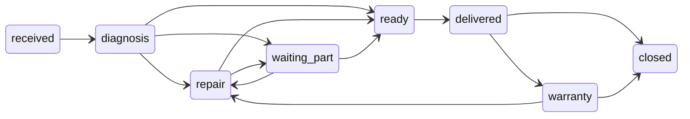
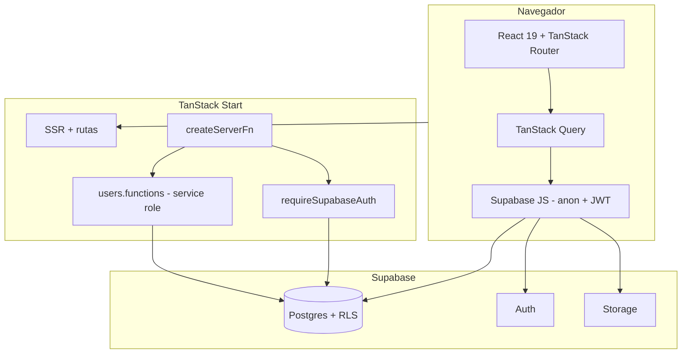

# Digitron App

Sistema web full-stack para la **gestión de órdenes de servicio técnico** de Digitron. Centraliza clientes, equipos, órdenes de reparación, asignación de técnicos, seguimiento de estados, evidencia fotográfica, auditoría de cambios y reportes operativos para un taller de servicio.

- **Idioma de la UI:** español
- **Marca en pantalla:** Digitron
- **Paquete npm:** `digitron-app`
- **Próximo paso planificado:** empaquetado como app de escritorio con **Electron**

---

## Tabla de contenidos

- [Para quién es](#para-quién-es)
- [Qué puedes hacer en la app](#qué-puedes-hacer-en-la-app)
- [Características por módulo](#características-por-módulo)
- [Roles y permisos](#roles-y-permisos)
- [Estados de una orden](#estados-de-una-orden)
- [Flujo de trabajo típico](#flujo-de-trabajo-típico)
- [Modelo de datos](#modelo-de-datos)
- [Arquitectura](#arquitectura)
- [Stack tecnológico](#stack-tecnológico)
- [Requisitos previos](#requisitos-previos)
- [Instalación y puesta en marcha](#instalación-y-puesta-en-marcha)
- [Usuarios de prueba (sin registro público)](#usuarios-de-prueba-sin-registro-público)
- [Configuración de Supabase](#configuración-de-supabase)
- [Variables de entorno](#variables-de-entorno)
- [Estructura del proyecto](#estructura-del-proyecto)
- [Scripts](#scripts)
- [Desarrollo local](#desarrollo-local)
- [Despliegue en Cloudflare (opcional)](#despliegue-en-cloudflare-opcional)
- [Seguridad](#seguridad)
- [Roadmap](#roadmap)
- [Documentación adicional](#documentación-adicional)

---

## Para quién es

| Perfil            | Uso principal                                                                      |
| ----------------- | ---------------------------------------------------------------------------------- |
| **Administrador** | Supervisión del taller, reportes, gestión de usuarios, cierre y entrega de órdenes |
| **Técnico**       | Órdenes asignadas, avance de diagnóstico/reparación, fotos y notas en campo        |

No hay autoservicio para clientes finales: es una herramienta **interna del taller**.

---

## Qué puedes hacer en la app

- Registrar **clientes** y sus **equipos** (marca, modelo, serie).
- Abrir **órdenes de servicio** con descripción del problema y técnico asignado.
- Mover cada orden por un **flujo de estados** controlado (recibido → diagnóstico → reparación → listo → entregado, etc.).
- Adjuntar hasta **5 fotos** por orden (almacenamiento privado en Supabase).
- Consultar **bitácora de auditoría** automática (quién cambió estado, técnico, costos, notas).
- Ver **panel** con KPIs y órdenes estancadas (sin movimiento en más de 7 días).
- Generar **reportes** en pantalla y exportar tablas a **PDF** (solo admin).
- Gestionar **usuarios** del sistema (solo admin; no hay página de registro).

---

## Características por módulo

| Ruta               | Quién          | Qué incluye                                                                                                                               |
| ------------------ | -------------- | ----------------------------------------------------------------------------------------------------------------------------------------- |
| `/login`           | Todos          | Email + contraseña (Supabase Auth). Redirección al panel tras login.                                                                      |
| `/dashboard`       | Admin, técnico | Tarjetas de resumen, órdenes recientes, alertas de órdenes sin actualizar. El técnico ve prioridad en _sus_ órdenes activas.              |
| `/orders`          | Admin, técnico | Listado con filtros por estado y búsqueda por número/cliente.                                                                             |
| `/orders/new`      | Admin, técnico | Alta de orden: cliente, equipo, técnico, descripción del problema. Número `ORD-YYYY-XXXX` automático.                                     |
| `/orders/:orderId` | Admin, técnico | Detalle completo: cambio de estado (según rol), técnico, repuesto en espera, costos estimado/final, notas, fotos, historial de auditoría. |
| `/clients`         | Admin, técnico | CRUD de clientes (nombre, teléfono, email). Borrado solo admin.                                                                           |
| `/equipment`       | Admin, técnico | CRUD de equipos ligados a un cliente. Borrado solo admin.                                                                                 |
| `/reports`         | Solo admin     | Distribución por estado, carga por técnico, ingresos por mes, top clientes; botones de exportación PDF.                                   |
| `/usuarios`        | Solo admin     | Crear usuarios (email, contraseña temporal, nombre, rol), cambiar rol, eliminar. Requiere `SUPABASE_SERVICE_ROLE_KEY` en el servidor.     |

---

## Roles y permisos

| Acción                                    | Admin |       Técnico       |
| ----------------------------------------- | :---: | :-----------------: |
| Panel, listados, clientes, equipos        |  Sí   |         Sí          |
| Crear órdenes                             |  Sí   |         Sí          |
| Editar órdenes asignadas a otro técnico   |  Sí   | No (solo las suyas) |
| Estados de taller (`diagnosis` … `ready`) |  Sí   | Sí, en sus órdenes  |
| `delivered`, `closed`, `warranty`         |  Sí   |         No          |
| Reportes y PDF                            |  Sí   |         No          |
| Usuarios (`/usuarios`)                    |  Sí   |         No          |
| Eliminar clientes / equipos               |  Sí   |         No          |

La autorización real está en **Postgres (RLS)** con `auth.uid()` y la función `has_role()`. La UI y las server functions son una capa adicional.

---

## Estados de una orden

Valores en base de datos (`order_status`) y etiquetas en español ([`src/lib/digitron.ts`](./src/lib/digitron.ts)):

| Estado (DB)    | Etiqueta en UI        |
| -------------- | --------------------- |
| `received`     | Recibido              |
| `diagnosis`    | En diagnóstico        |
| `repair`       | En reparación         |
| `waiting_part` | En espera de repuesto |
| `ready`        | Listo para entrega    |
| `delivered`    | Entregado             |
| `closed`       | Cerrado               |
| `warranty`     | Garantía              |



Las transiciones permitidas desde la app están en [`src/lib/state-machine.ts`](./src/lib/state-machine.ts) (además de las políticas RLS en Postgres).

---

## Flujo de trabajo típico

1. **Recepción** — Admin o técnico crea cliente/equipo si no existen y abre una orden en estado _Recibido_.
2. **Asignación** — Se asigna técnico; la orden pasa a _En diagnóstico_ (técnico en sus órdenes).
3. **Taller** — El técnico actualiza a _En reparación_, _En espera de repuesto_ o _Listo para entrega_, sube fotos y anota costos.
4. **Cierre operativo** — Admin marca _Entregado_ y luego _Cerrado_ (o _Garantía_ si aplica).
5. **Supervisión** — Admin revisa `/dashboard` y `/reports`; la bitácora en el detalle de la orden registra cada cambio relevante.

---

## Modelo de datos

Relaciones principales (esquema `public`):

```mermaid
erDiagram
  profiles ||--o{ orders : "technician_id"
  clients ||--o{ equipment : "client_id"
  clients ||--o{ orders : "client_id"
  equipment ||--o{ orders : "equipment_id"
  orders ||--o{ order_photos : "order_id"
  orders ||--o{ audit_log : "order_id"
  profiles {
    uuid id PK
    text full_name
    app_role role
  }
  clients {
    uuid id PK
    text name
    text phone
    text email
  }
  equipment {
    uuid id PK
    uuid client_id FK
    text type brand model
    text serial_number
  }
  orders {
    uuid id PK
    text order_number UK
    uuid client_id FK
    uuid equipment_id FK
    uuid technician_id FK
    order_status status
    text problem_description
    numeric estimated_cost final_cost
  }
```

| Tabla          | Descripción                                                                   |
| -------------- | ----------------------------------------------------------------------------- |
| `profiles`     | Perfil por usuario Auth (`id` = `auth.users.id`). Rol `admin` o `technician`. |
| `clients`      | Clientes del taller.                                                          |
| `equipment`    | Equipos; cada fila pertenece a un cliente.                                    |
| `orders`       | Orden de servicio; número generado por trigger `generate_order_number`.       |
| `order_photos` | Metadatos de fotos; archivo en bucket Storage `order-photos`.                 |
| `audit_log`    | Historial; inserts vía trigger `log_order_changes` en `orders`.               |

Migraciones versionadas en [`supabase/migrations/`](./supabase/migrations/). Guía de aplicación: [`supabase/README.md`](./supabase/README.md).

Carpeta **`supabase/.temp/`** (gitignored): caché local del CLI tras `supabase link` (project ref, versiones). No se commitea.

---

## Arquitectura



Puntos clave:

- **Monorepo full-stack:** UI y server functions en TypeScript compartido.
- **Lecturas/escrituras habituales:** cliente Supabase en el navegador; RLS filtra por usuario.
- **Operaciones privilegiadas:** p. ej. crear usuarios Auth → [`src/lib/users.functions.ts`](./src/lib/users.functions.ts) con `SUPABASE_SERVICE_ROLE_KEY` solo en servidor.
- **Sin Edge Functions** de Supabase para lógica de negocio interna.
- **Producción opcional:** build con plugin Cloudflare → Worker ([`src/server.ts`](./src/server.ts), [`wrangler.jsonc`](./wrangler.jsonc)).

Convenciones de código: [`ENGINEERING.md`](./ENGINEERING.md). Guía para agentes IA: [`AGENTS.md`](./AGENTS.md).

---

## Stack tecnológico

| Capa                  | Tecnología                                                    |
| --------------------- | ------------------------------------------------------------- |
| Framework             | [TanStack Start](https://tanstack.com/start) + Vite 7         |
| Routing               | [TanStack Router](https://tanstack.com/router) (file-based)   |
| Datos en cliente      | [TanStack Query](https://tanstack.com/query)                  |
| UI                    | React 19, Tailwind CSS v4, [shadcn/ui](https://ui.shadcn.com) |
| Backend / API interna | TanStack `createServerFn`                                     |
| Base de datos         | Supabase Postgres + **RLS**                                   |
| Auth                  | Supabase Auth (email/password)                                |
| Archivos              | Supabase Storage (`order-photos`)                             |
| Formularios           | React Hook Form + Zod                                         |
| PDF                   | jsPDF + jspdf-autotable                                       |
| Deploy (opcional)     | Cloudflare Workers                                            |
| Runtime local         | [Bun](https://bun.sh) recomendado                             |

---

## Requisitos previos

Checklist antes de desarrollar:

- [ ] [Bun](https://bun.sh) instalado **o** Node **≥ 20.19** / **≥ 22.12** ([`.nvmrc`](./.nvmrc) → 22)
- [ ] Proyecto en [Supabase](https://supabase.com) creado
- [ ] [Supabase CLI](https://supabase.com/docs/guides/cli) (`brew install supabase/tap/supabase` en Mac ARM: `arch -arm64 brew install supabase/tap/supabase`)
- [ ] Migraciones aplicadas (`supabase db push`)
- [ ] `.env.local` con URL, anon key y service role (ver abajo)
- [ ] Al menos un usuario **admin** para entrar a la app

---

## Instalación y puesta en marcha

### 1. Clonar e instalar dependencias

```bash
git clone https://github.com/TU_ORG/digitron-app.git
cd digitron-app
bun install
```

### 2. Variables de entorno

```bash
cp .env.example .env.local
```

Edita `.env.local` con las claves de **Project Settings → API** en Supabase. Detalle en [Variables de entorno](#variables-de-entorno).

> Usa `.env.local` en desarrollo. No commitees `.env` ni `.env.local`.

### 3. Base de datos

```bash
supabase login
supabase link --project-ref TU_PROJECT_REF
supabase db push
```

### 4. Arrancar la app

```bash
bun run dev
```

Debes ver:

```text
➜  Local:   http://localhost:5173/
```

Abre esa URL. Si no aparece el puerto, revisa [Desarrollo local → Problemas frecuentes](#problemas-frecuentes).

### 5. Primer login

Crea un usuario admin (siguiente sección) e inicia sesión en `/login`.

---

## Usuarios de prueba (sin registro público)

**No existe pantalla de registro.** Solo login. Los usuarios se crean así:

### A. Primer admin (base de datos vacía)

1. Supabase Dashboard → **Authentication** → **Users** → **Add user**.
2. Email, contraseña (mín. 6 caracteres), activar **Auto Confirm User**.
3. Si `profiles` estaba vacío, el trigger `handle_new_user` asigna **`admin`** al primer usuario.
4. Login en `http://localhost:5173/login`.

### B. Desde la app (ya con un admin)

1. Confirma `SUPABASE_SERVICE_ROLE_KEY` en `.env.local`.
2. Entra como admin → menú **Usuarios** (`/usuarios`).
3. Completa email, contraseña, nombre y rol (`admin` o `technician`).
4. Entrega la contraseña al usuario por un canal seguro (no hay email automático de invitación en esta versión).

### C. Promover o corregir rol en SQL

```sql
-- Sustituye UUID_DEL_USUARIO por el id de Authentication → Users
UPDATE public.profiles
SET role = 'admin', full_name = 'Admin de prueba'
WHERE id = 'UUID_DEL_USUARIO';
```

### Ejemplo solo para desarrollo local

| Campo    | Valor sugerido                               |
| -------- | -------------------------------------------- |
| Email    | `admin@test.com`                             |
| Password | `admin123` (o más fuerte en entornos reales) |
| Rol      | `admin` (automático si es el primer perfil)  |

Para un técnico de prueba, créalo en `/usuarios` con rol **Técnico** o usa el mismo flujo en el dashboard de Auth y deja `role = 'technician'` en `profiles`.

---

## Configuración de Supabase

### Enlazar el proyecto local

El `project_id` en [`supabase/config.toml`](./supabase/config.toml) es un placeholder. El CLI guarda el proyecto real en `supabase/.temp/` al hacer:

```bash
supabase link --project-ref TU_PROJECT_REF
```

(`TU_PROJECT_REF` aparece en la URL del dashboard: `https://supabase.com/dashboard/project/<ref>`.)

### Verificar después de `db push`

En el dashboard deberías tener:

- Tablas: `profiles`, `clients`, `equipment`, `orders`, `order_photos`, `audit_log`
- Bucket **order-photos** (privado, imágenes JPEG/PNG/WebP, límite 5 MB por archivo)
- RLS **enabled** en tablas de `public`

### Orden de migraciones

1. `20260516231057_…sql` — esquema, enums, RLS, triggers de número de orden y auditoría
2. `20260516231116_…sql` — endurecimiento `search_path` y grants en funciones
3. `20260517134255_…sql` — trigger en `auth.users`, políticas de Storage

Detalle: [`supabase/README.md`](./supabase/README.md).

---

## Variables de entorno

| Variable                        | Dónde                | Descripción                                                   |
| ------------------------------- | -------------------- | ------------------------------------------------------------- |
| `VITE_SUPABASE_URL`             | Cliente (build Vite) | URL del proyecto                                              |
| `VITE_SUPABASE_PUBLISHABLE_KEY` | Cliente              | Clave **anon** (segura en el navegador con RLS)               |
| `SUPABASE_URL`                  | Servidor             | Misma URL                                                     |
| `SUPABASE_PUBLISHABLE_KEY`      | Servidor             | Misma anon key (middleware SSR / server functions con sesión) |
| `SUPABASE_SERVICE_ROLE_KEY`     | Servidor **solo**    | Admin Auth y bypass RLS — **nunca** `VITE_*`                  |

Ejemplo `.env.local`:

```env
VITE_SUPABASE_URL=https://xxxxxxxx.supabase.co
VITE_SUPABASE_PUBLISHABLE_KEY=eyJhbGciOiJIUzI1NiIsInR5cCI6IkpXVCJ9...

SUPABASE_URL=https://xxxxxxxx.supabase.co
SUPABASE_PUBLISHABLE_KEY=eyJhbGciOiJIUzI1NiIsInR5cCI6IkpXVCJ9...
SUPABASE_SERVICE_ROLE_KEY=eyJhbGciOiJIUzI1NiIsInR5cCI6IkpXVCJ9...
```

Plantilla vacía: [`.env.example`](./.env.example).

---

## Estructura del proyecto

```
digitron-app/
├── src/
│   ├── routes/                    # Páginas (TanStack Router)
│   │   ├── __root.tsx             # HTML shell, tema, meta
│   │   ├── login.tsx
│   │   └── _authenticated/        # Rutas tras login
│   ├── lib/
│   │   ├── digitron.ts            # Labels ES, enums de estado
│   │   ├── state-machine.ts       # Transiciones por rol
│   │   └── users.functions.ts     # CRUD usuarios (server)
│   ├── integrations/supabase/     # Cliente, auth middleware, types
│   ├── components/                # UI + app-sidebar
│   ├── hooks/                     # useAuth, useTheme, …
│   ├── start.ts                   # Middleware global Start
│   └── server.ts                  # Entry Worker (producción CF)
├── supabase/
│   ├── migrations/                # SQL versionado
│   ├── config.toml
│   └── .temp/                     # CLI local (gitignored)
├── vite.config.ts                 # CF_WORKERS=0 en dev por defecto
├── wrangler.jsonc
├── AGENTS.md
├── ENGINEERING.md
└── package.json
```

**No editar** `src/routeTree.gen.ts` (generado por el plugin del router).

---

## Scripts

| Comando             | Uso                                                                           |
| ------------------- | ----------------------------------------------------------------------------- |
| `bun run dev`       | Desarrollo en **http://localhost:5173** (`CF_WORKERS=0`, sin runtime Workers) |
| `bun run dev:cf`    | Dev con runtime Cloudflare (más lento; probar paridad con producción)         |
| `bun run build`     | Build producción (`dist/`, con Cloudflare)                                    |
| `bun run build:dev` | Build modo development                                                        |
| `bun run preview`   | Servir el build localmente                                                    |
| `bun run lint`      | ESLint                                                                        |
| `bun run format`    | Prettier en el repo                                                           |

---

## Desarrollo local

### Por qué `bun run dev` y no solo `vite dev`

- El plugin **Cloudflare** en dev + runtime **Bun** puede colgar el arranque y no exponer puerto.
- `vite.config.ts` desactiva Cloudflare cuando `CF_WORKERS=0` (valor por defecto del script `dev`).
- `build` / `preview` sí activan Cloudflare (`CF_WORKERS=1`).

### Convenciones al contribuir

- Navegación interna: `<Link>` / `useNavigate` de `@tanstack/react-router`.
- Lógica con datos sensibles: `createServerFn` + `requireSupabaseAuth` en `src/lib/*.functions.ts`.
- Cambios de esquema: nueva migración en `supabase/migrations/`, luego `supabase db push`.
- Estilos: tokens en [`src/styles.css`](./src/styles.css); evitar `text-white` / hex sueltos en componentes.

### Electron (futuro)

```bash
ELECTRON=true bun run build
```

(`base: './'` en Vite para cargar desde `file://`.)

### Problemas frecuentes

| Síntoma                                    | Qué hacer                                                                                                                       |
| ------------------------------------------ | ------------------------------------------------------------------------------------------------------------------------------- |
| No aparece `Local: http://localhost:5173/` | Usa `bun run dev` (no `vite dev` a mano). No uses `dev:cf` salvo que pruebes Workers.                                           |
| `lightningcss.darwin-x64.node` not found   | Node bajo Rosetta (x64) con deps ARM. Usa `bun run dev` o instala Node 22 **arm64** (`nvm install 22` en terminal sin Rosetta). |
| Missing Supabase environment variables     | Crea `.env.local` desde `.env.example`.                                                                                         |
| 401 en server functions                    | Usuario no logueado o llamada desde loader público sin Bearer.                                                                  |
| `/usuarios` falla al crear usuario         | Falta `SUPABASE_SERVICE_ROLE_KEY` en `.env.local`.                                                                              |
| `brew install supabase` falla en Mac ARM   | `arch -arm64 brew install supabase/tap/supabase`                                                                                |
| Build falla por versión de Node            | `nvm use` → Node 22, o `bun --bun run build`                                                                                    |

---

## Despliegue en Cloudflare (opcional)

1. Variables en Cloudflare Workers / build: mismas `SUPABASE_*`; las `VITE_*` se embeben en el cliente en build time.
2. `bun run build`
3. Despliegue con [Wrangler](https://developers.cloudflare.com/workers/wrangler/) según la [guía TanStack Start + Cloudflare](https://developers.cloudflare.com/workers/framework-guides/web-apps/tanstack/).

Entry del worker: [`src/server.ts`](./src/server.ts) (envuelve el handler de TanStack Start y páginas de error).

---

## Seguridad

- **RLS** en tablas de negocio; roles con `has_role()` (SECURITY DEFINER).
- **Service role** solo en servidor; nunca en variables `VITE_*` ni en el bundle del cliente.
- No commitear `.env`, `.env.local`, `supabase/.temp/`.
- Si alguna clave estuvo en git: **rotar** anon y service role en Supabase antes de publicar el repositorio.

---

## Roadmap

- [ ] Wrapper **Electron** para escritorio
- [ ] Tablas con **TanStack Table**
- [ ] **i18n** (react-i18next, ES / EN)
- [ ] PDF ampliado (recibos, más reportes)
- [ ] **Auto-updater** en builds de escritorio

---

## Documentación adicional

| Documento                                    | Contenido                                                        |
| -------------------------------------------- | ---------------------------------------------------------------- |
| [`AGENTS.md`](./AGENTS.md)                   | Reglas para agentes de IA (Supabase, secretos, server functions) |
| [`ENGINEERING.md`](./ENGINEERING.md)         | Arquitectura detallada y errores comunes                         |
| [`supabase/README.md`](./supabase/README.md) | Migraciones y CLI                                                |

---

## Licencia

Proyecto privado de Digitron salvo que se indique otra licencia en el repositorio.
