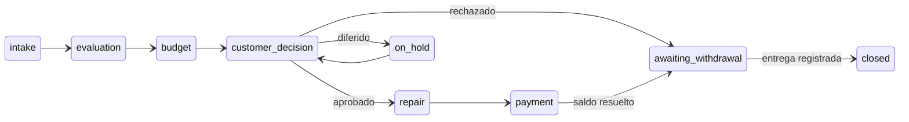
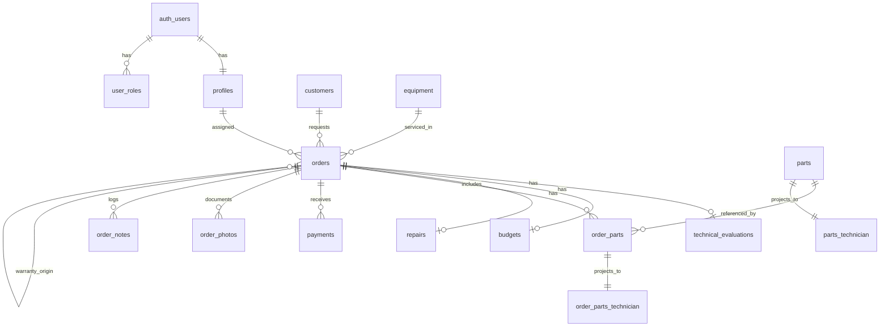
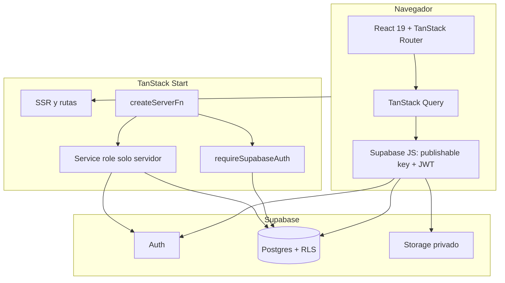

# Digitron App

Sistema web full-stack para gestionar el ciclo completo de las **órdenes de servicio técnico** de Digitron. Centraliza clientes, equipos, evaluaciones, presupuestos, reparaciones, inventario, pagos, fotografías, auditoría y reportes operativos.

- **Uso:** herramienta interna del taller; no hay autoservicio para clientes.
- **Idioma principal de la UI:** español, con infraestructura i18n ES/EN.
- **Marca en pantalla:** Digitron.
- **Paquete npm:** `digitron-app`.
- **Próximo objetivo de plataforma:** empaquetado de escritorio con Electron.

---

## Funcionalidad

- Registrar clientes y equipos. Los clientes se buscan por nombre, teléfono o cédula; los equipos incluyen una descripción opcional y se buscan por descripción, marca, modelo o serie. El equipo es un activo independiente y la orden registra qué cliente lo presenta en cada visita.
- Abrir órdenes con cliente, equipo, origen, falla reportada, condición del equipo, accesorios recibidos, técnico y anticipo opcional.
- Generar y reimprimir la orden de servicio en PDF a partir de la plantilla editable de Digitron.
- Guiar cada orden por evaluación, presupuesto, decisión del cliente, reparación, pago, espera de retiro y cierre.
- Cotizar repuestos durante la evaluación —incluyendo crear uno nuevo sin abandonar la orden— y consumir durante la reparación únicamente los repuestos evaluados, con actualización transaccional del inventario.
- Mantener un catálogo de repuestos con código, stock, ubicación, descripción, ficha técnica, sustituto NTE, imagen, costo unitario y proveedor; ficha técnica e imagen se abren como enlaces externos seguros.
- Registrar anticipos y múltiples pagos o métodos de pago sin permitir que excedan el saldo real del presupuesto; el presupuesto aprobado no cambia al consumir un repuesto.
- Adjuntar fotografías privadas y mantener notas internas append-only, incluso después del cierre para los roles autorizados.
- Registrar en historial y auditoría los cambios de evaluación, presupuesto, reparación, pagos, repuestos, notas, fotos, entrega y demás datos operativos.
- Crear en servidor una nueva orden de garantía enlazada con una orden cerrada; la acción de UI para invocar esta capacidad todavía está pendiente.
- Consultar el tablero operativo y construir listados de órdenes con encabezados configurables, filtros lógicos y exportación CSV, Excel o PDF.
- Administrar cuentas y roles sin registro público.
- Consultar la versión formal `O3S v1.0` y descargar el Manual de Usuario oficial desde el sidebar autenticado.

## Módulos

| Ruta               | Acceso principal                                          | Función                                                                                                                    |
| ------------------ | --------------------------------------------------------- | -------------------------------------------------------------------------------------------------------------------------- |
| `/login`           | Público                                                   | Inicio de sesión con Supabase Auth.                                                                                        |
| `/dashboard`       | Administrativo, técnico, super                            | KPIs, órdenes recientes, estancadas y bandeja de acciones pendientes por rol.                                              |
| `/orders`          | Administrativo, técnico asignado, super                   | Listado y filtros por etapa, técnico, fechas, cliente y equipo.                                                            |
| `/orders/new`      | Administrativo, super                                     | Alta de orden y descarga automática de la orden de servicio en PDF.                                                        |
| `/orders/:orderId` | Según RLS                                                 | Flujo guiado en módulos colapsables: cliente/equipo, evaluación, presupuesto, reparación, pagos, fotos, notas e historial. |
| `/clients`         | Administrativo, super                                     | Directorio, mantenimiento y búsqueda por nombre, teléfono o cédula.                                                        |
| `/equipment`       | Lectura técnico; edición administrativo/super             | Activos con descripción, historial y búsqueda por descripción, marca, modelo o serie; los errores ofrecen reintento.       |
| `/inventory`       | Lectura restringida técnico; edición administrativo/super | Catálogo ampliado; técnicos ven metadatos operativos y administración también ve stock, costo y proveedor.                 |
| `/reports`         | Administrativo, super                                     | Listado configurable de órdenes: selección y orden de encabezados, filtros tipados y exportación CSV, Excel o PDF.         |
| `/usuarios`        | Super                                                     | Crear, cambiar rol y eliminar usuarios mediante operaciones solo servidor.                                                 |
| `/configuracion`   | Usuarios autenticados                                     | Perfil, tema e idioma.                                                                                                     |

La visibilidad de la UI mejora la experiencia, pero la autorización efectiva está en **Postgres RLS** y en las validaciones de las server functions.

### Reportes configurables

`/reports` carga bajo RLS los datos relacionados de órdenes, clientes, equipos, evaluaciones, presupuestos, reparaciones y pagos. El usuario puede seleccionar cualquier encabezado disponible, cambiar su orden y combinar condiciones de texto, número, fecha o valor lógico mediante grupos **Y** y alternativas **O**.

La tabla y las exportaciones siempre usan las órdenes filtradas y el orden visible de los encabezados. El menú de exportación genera CSV, Excel (`.xls` compatible con SpreadsheetML) o PDF; el CSV neutraliza textos con apariencia de fórmula antes de abrirlos en una hoja de cálculo. Los paneles anteriores de rango de fechas, estado, carga por técnico, últimos meses, clientes, repuestos y garantías ya no forman parte de este módulo.

---

## Roles y permisos

Los roles vigentes son `cliente`, `administrativo`, `tecnico` y `super`. Se almacenan en `user_roles`, no en `profiles`.

| Módulo           | Cliente  | Administrativo | Técnico              | Super        |
| ---------------- | -------- | -------------- | -------------------- | ------------ |
| Público          | Consulta | Consulta       | Consulta             | Consulta     |
| Clientes         | —        | Modificación   | —                    | Modificación |
| Equipo           | —        | Modificación   | Consulta             | Modificación |
| Reportes         | —        | Consulta       | —                    | Consulta     |
| Inventario       | —        | Modificación   | Consulta restringida | Modificación |
| OS · Apertura    | —        | Ingreso        | —                    | Modificación |
| OS · Evaluación  | —        | Consulta       | Ingreso en asignadas | Modificación |
| OS · Presupuesto | —        | Ingreso        | —                    | Modificación |
| OS · Reparación  | —        | Consulta       | Ingreso en asignadas | Modificación |
| OS · Cierre      | —        | Ingreso        | —                    | Modificación |
| Tablero          | —        | Consulta       | Consulta             | Consulta     |
| Seguridad        | —        | Consulta       | —                    | Modificación |

La matriz ejecutable está en [`src/lib/access.ts`](./src/lib/access.ts) y las políticas en [`supabase/migrations/`](./supabase/migrations/).

---

## Flujo de una orden

El enum `order_stage` define estas etapas:

| Etapa                 | Etiqueta             | Responsable de completar la acción |
| --------------------- | -------------------- | ---------------------------------- |
| `intake`              | Recepción            | Administrativo                     |
| `evaluation`          | Evaluación técnica   | Técnico asignado                   |
| `budget`              | Presupuesto          | Administrativo                     |
| `customer_decision`   | Decisión del cliente | Administrativo                     |
| `on_hold`             | En espera            | Espera de repuesto o autorización  |
| `repair`              | Reparación           | Técnico asignado                   |
| `payment`             | Pago                 | Administrativo                     |
| `awaiting_withdrawal` | Pendiente de retiro  | Administrativo                     |
| `closed`              | Cerrado              | Administrativo                     |


```mermaid
stateDiagram-v2
  direction LR
  intake --> evaluation
  evaluation --> budget
  budget --> customer_decision
  customer_decision --> repair: aprobado
  customer_decision --> on_hold: diferido
  customer_decision --> awaiting_withdrawal: rechazado
  on_hold --> customer_decision
  repair --> payment
  payment --> awaiting_withdrawal: saldo resuelto
  awaiting_withdrawal --> closed: entrega registrada
```

En la implementación actual, el formulario de alta completa la recepción y crea la orden directamente en `evaluation`. `intake` se conserva en el modelo y en la máquina de estados para representar el inicio formal del proceso.

Reglas principales:

- El técnico solo actúa sobre órdenes asignadas.
- Solo se entra a `repair` con un presupuesto aprobado.
- Una decisión diferida requiere motivo y mueve la orden a `on_hold`. El motivo también se copia a notas internas y queda en la bitácora y el historial.
- Una decisión rechazada mueve la orden directamente a `awaiting_withdrawal`, sin reparación.
- Solo se avanza desde `payment` a `awaiting_withdrawal` con el saldo pagado o expresamente condonado.
- El campo **Recibido por** se completa al entregar el equipo desde `awaiting_withdrawal`; esa entrega cierra la orden.
- En reparación solo pueden seleccionarse repuestos agregados previamente durante la evaluación técnica y con inventario suficiente.
- Los módulos de detalle son colapsables. La etapa activa se abre automáticamente; las etapas inactivas, Fotos, Notas internas e Historial se mantienen compactos hasta que el usuario los abra.
- Los borradores de formularios se conservan al cambiar de pestaña del navegador y al contraer un módulo.
- Las correcciones hacia atrás son limitadas y requieren una nota con el motivo.
- Una garantía crea otra orden enlazada mediante `warranty_origin_id`; no es una etapa del enum y la orden origen debe estar en `closed`. Actualmente esta operación está disponible como server function, pero su acción de UI está pendiente.
- “Notificar al cliente” registra un timestamp auditado. El envío real de email todavía no está implementado.

La fuente canónica del proceso es [`docs/service-order-flow.md`](./docs/service-order-flow.md); las reglas ejecutables están en [`src/lib/state-machine.ts`](./src/lib/state-machine.ts) y [`src/lib/orders.functions.ts`](./src/lib/orders.functions.ts).

---

## Modelo de datos


```mermaid
erDiagram
  auth_users ||--|| profiles : has
  auth_users ||--o{ user_roles : has
  profiles ||--o{ orders : assigned
  customers ||--o{ orders : requests
  equipment ||--o{ orders : serviced_in
  orders ||--o| technical_evaluations : has
  orders ||--o| budgets : has
  orders ||--o| repairs : has
  orders ||--o{ order_parts : includes
  parts ||--o{ order_parts : referenced_by
  parts ||--|| parts_technician : projects_to
  order_parts ||--|| order_parts_technician : projects_to
  orders ||--o{ payments : receives
  orders ||--o{ order_photos : documents
  orders ||--o{ order_notes : logs
  orders ||--o{ orders : warranty_origin
```

| Tabla                    | Descripción                                                                                                         |
| ------------------------ | ------------------------------------------------------------------------------------------------------------------- |
| `profiles`               | Perfil del usuario Auth: nombre, email y estado activo.                                                             |
| `user_roles`             | Roles `cliente`, `administrativo`, `tecnico` y `super`.                                                             |
| `customers`              | Cliente y datos de contacto; identificación opcional pero única si se informa.                                      |
| `equipment`              | Activo independiente con descripción libre opcional; serie opcional pero única si se informa.                       |
| `orders`                 | Agregado principal: cliente/equipo de la visita, condición al recibir, etapa y entrega.                             |
| `technical_evaluations`  | Diagnóstico y observaciones del técnico.                                                                            |
| `budgets`                | Presupuesto único por orden, costos, anticipo y decisión del cliente.                                               |
| `parts`                  | Catálogo comercial: código, stock, ubicación, descripción, ficha técnica, sustituto NTE, imagen, costo y proveedor. |
| `parts_technician`       | Proyección RLS con metadatos de repuesto seguros para técnicos; no contiene stock, costo ni proveedor.              |
| `order_parts`            | Repuestos cotizados en evaluación o usados en reparación, con snapshots de costo y disponibilidad.                  |
| `order_parts_technician` | Proyección RLS de líneas de repuesto sin snapshots comerciales.                                                     |
| `repairs`                | Trabajo realizado, técnico y estado de reparación.                                                                  |
| `payments`               | Pagos registrados para la orden.                                                                                    |
| `order_photos`           | Metadatos de archivos privados en Storage.                                                                          |
| `order_notes`            | Bitácora humana interna append-only.                                                                                |
| `audit_log`              | Auditoría técnica de órdenes y módulos relacionados, generada automáticamente por triggers.                         |

Los técnicos consultan inventario mediante las tablas físicas de lectura derivadas y protegidas por RLS `parts_technician` y `order_parts_technician`; no son vistas y costos, stock y proveedor permanecen protegidos. Triggers internos mantienen estas proyecciones desde las tablas comerciales dentro de la misma transacción.

### Numeración

`generate_order_number()` continúa la numeración histórica de Digitron. Si una importación no proporciona el número, asigna el siguiente valor numérico posterior al mayor existente, con piso en `47719`. Un advisory lock evita duplicados por concurrencia.

---

## Arquitectura


```mermaid
flowchart TB
  subgraph Browser[Navegador]
    UI[React 19 + TanStack Router]
    Query[TanStack Query]
    BrowserSB[Supabase JS: publishable key + JWT]
    UI --> Query --> BrowserSB
  end

  subgraph App[TanStack Start]
    SSR[SSR y rutas]
    Fn[createServerFn]
    AuthMW[requireSupabaseAuth]
    Admin[Service role solo servidor]
    Fn --> AuthMW
    Fn --> Admin
  end

  subgraph Supabase[Supabase]
    Auth[Auth]
    DB[(Postgres + RLS)]
    Storage[Storage privado]
  end

  Browser --> SSR
  BrowserSB --> Auth
  BrowserSB --> DB
  BrowserSB --> Storage
  AuthMW --> DB
  Admin --> Auth
  Admin --> DB
```

- Las consultas habituales usan repositorios en `src/lib/repositories/` y el cliente Supabase del navegador; `supabase-js` llama directamente a Data API/PostgREST y RLS aplica el alcance real.
- Las transiciones y operaciones sensibles usan `createServerFn` con `requireSupabaseAuth`.
- La gestión de usuarios usa `SUPABASE_SERVICE_ROLE_KEY` exclusivamente dentro de handlers de servidor.
- No hay endpoints REST propios ni se usan Supabase Edge Functions para la lógica interna.
- Producción se despliega automáticamente en Vercel/Nitro; Cloudflare Workers permanece como destino alternativo soportado.

### Dónde se consultan los datos

Para equipos, el llamado comienza en [`src/routes/_authenticated/equipment.tsx`](./src/routes/_authenticated/equipment.tsx), donde TanStack Query ejecuta `equipmentRepository.getPage(...)`. El repositorio está en [`src/lib/repositories/equipment.repository.ts`](./src/lib/repositories/equipment.repository.ts) y combina búsqueda, orden, conteo y rango sobre `equipment` con el cliente browser de Supabase.

```text
/equipment → useQuery(["equipment", { page, pageSize, search }])
           → equipmentRepository.getPage(...)
           → supabase.from("equipment").select(..., { count: "exact" }).range(...)
           → Supabase Data API/PostgREST → Postgres + RLS
```

Si esa consulta falla, la página muestra el error real y permite reintentar; no presenta el inventario como vacío. Las server functions se reservan para transiciones, decisiones, entrega, garantías y otras reglas sensibles que requieren validación adicional.

Los listados principales de órdenes, clientes, equipos e inventario solicitan como máximo 50 filas por página. Búsqueda y filtros se aplican antes de `.range(...)` en PostgREST. Órdenes usa `public.orders_list`, un read model `security_invoker` que aplana únicamente los campos de la tabla sin evadir los grants ni RLS de las relaciones base; por ello los técnicos continúan recibiendo solo sus órdenes asignadas.

## Stack

| Capa            | Tecnología                                        |
| --------------- | ------------------------------------------------- |
| Framework       | TanStack Start, React 19, Vite 7                  |
| Routing y datos | TanStack Router + TanStack Query                  |
| UI              | Tailwind CSS v4, shadcn/ui, Radix UI, Recharts    |
| Formularios     | React Hook Form + Zod                             |
| Backend interno | TanStack `createServerFn`                         |
| Datos           | Supabase Postgres + RLS                           |
| Auth y archivos | Supabase Auth + Storage privado                   |
| Documentos      | `pdf-lib`, jsPDF, jspdf-autotable y SpreadsheetML |
| i18n            | i18next + react-i18next                           |
| Testing         | Vitest + Playwright                               |
| Deploy          | Cloudflare Workers o Vercel/Nitro                 |

---

## Requisitos

- Node **>=20.19** o **>=22.12** (`.nvmrc` usa Node 22).
- pnpm **>=11**.
- Supabase CLI y Docker para el stack local y las pruebas E2E.
- Un proyecto Supabase para trabajar contra un entorno remoto.

## Inicio rápido local

La forma recomendada para desarrollar sin tocar un proyecto remoto es:

```bash
pnpm install
pnpm run dev:local
```

Este script:

1. Inicia Supabase local si hace falta.
2. Aplica migraciones pendientes.
3. Crea o asegura un superusuario local.
4. Inyecta las credenciales locales en Vite.
5. Inicia la app en `http://localhost:5173`.

`pnpm run dev:local` conserva los datos existentes y aplica las migraciones pendientes, por lo que los cambios de esquema y lógica de base de datos quedan disponibles en el ambiente local. Si la aplicación ya estaba abierta, basta con recargar la página después de actualizar el código.

Credenciales predeterminadas de desarrollo local:

```text
admin@digitron.test / digitron123
```

Pueden reemplazarse con `ADMIN_EMAIL`, `ADMIN_PASSWORD` y `ADMIN_NAME`. Para reiniciar la base local y aplicar todo desde cero:

```bash
pnpm run dev:local:fresh
```

> Los scripts locales usan el stack Supabase local y no deben apuntar a producción. `dev:local:fresh` elimina los datos de la base local; `dev:local` no lo hace.

## Configuración remota

```bash
cp .env.example .env.local
supabase login
supabase link --project-ref TU_PROJECT_REF
supabase db push
pnpm run dev
```

El `project_id` de `supabase/config.toml` es un placeholder. `supabase link` guarda la referencia real en `supabase/.temp/`, que está ignorado por Git.

### Migraciones y schema cache

El pipeline de despliegue no aplica migraciones al Supabase remoto. Antes de desplegar código que consulta una tabla o columna nueva:

```bash
supabase migration list
supabase db push
```

Después regenere/verifique [`src/integrations/supabase/types.ts`](./src/integrations/supabase/types.ts) y pruebe la consulta contra el proyecto enlazado. La descripción de equipos requiere `20260723000631_add_equipment_description.sql`; las proyecciones RLS y el catálogo ampliado de repuestos requieren `20260808054134_secure_technician_read_models.sql` y `20260808063014_extend_parts_catalog.sql`.

El error `Could not find the '<column>' column ... in the schema cache` suele indicar que el código llegó antes que la migración. No significa que la tabla esté vacía: aplique/verifique la migración y recargue la consulta. Para tablas nuevas, confirme además su exposición/grants de Data API y sus políticas RLS.

### Variables de entorno

| Variable                        | Alcance       | Uso                                                           |
| ------------------------------- | ------------- | ------------------------------------------------------------- |
| `VITE_SUPABASE_URL`             | Navegador     | URL de Supabase.                                              |
| `VITE_SUPABASE_PUBLISHABLE_KEY` | Navegador     | Clave anon/publishable protegida por RLS.                     |
| `SUPABASE_URL`                  | Servidor      | URL usada por SSR y server functions.                         |
| `SUPABASE_PUBLISHABLE_KEY`      | Servidor      | Cliente autenticado que respeta RLS.                          |
| `SUPABASE_SERVICE_ROLE_KEY`     | Solo servidor | Gestión privilegiada de usuarios; nunca usar prefijo `VITE_`. |

No se incluyen valores de ejemplo que parezcan credenciales. La plantilla vacía está en [`.env.example`](./.env.example).

## Primer usuario y gestión de cuentas

No existe registro público.

- En una base vacía, `handle_new_user()` asigna `super` al primer usuario y `tecnico` a los siguientes.
- En local, `pnpm run dev:local` o `pnpm run seed:admin` prepara el superusuario.
- En un proyecto remoto, cree el primer usuario en Supabase Auth con email confirmado; el trigger crea `profiles` y `user_roles`.
- Un `super` puede administrar usuarios desde `/usuarios`. Esto requiere `SUPABASE_SERVICE_ROLE_KEY` en el servidor.
- Para corregir manualmente un rol, modifique `user_roles`, nunca agregue un campo de rol a `profiles`.

Ejemplo administrativo, sustituyendo los valores:

```sql
DELETE FROM public.user_roles WHERE user_id = 'UUID_DEL_USUARIO';
INSERT INTO public.user_roles (user_id, role)
VALUES ('UUID_DEL_USUARIO', 'super');
```

---

## Estructura

```text
digitron-app/
├── src/
│   ├── routes/                     # Rutas file-based
│   ├── components/                 # Componentes de aplicación y UI
│   ├── hooks/                      # Auth, tema, idioma y datos compartidos
│   ├── lib/
│   │   ├── repositories/           # Acceso normal a Supabase bajo RLS
│   │   ├── *.functions.ts          # Operaciones sensibles en servidor
│   │   ├── access.ts               # Matriz de permisos
│   │   ├── digitron.ts             # Roles, etapas y decisiones
│   │   ├── state-machine.ts        # Transiciones y gates
│   │   └── service-order-pdf.ts    # Orden de servicio PDF
│   ├── integrations/supabase/      # Clientes, auth middleware y tipos
│   ├── locales/                    # Traducciones ES/EN
│   ├── start.ts                    # Middleware global
│   └── server.ts                   # Entry SSR y manejo de errores
├── supabase/
│   ├── migrations/                 # Esquema, RLS, triggers y Storage
│   ├── seed.sql
│   └── config.toml
├── docs/                            # Modelo, flujo y contratos
├── e2e/                             # Playwright + fixtures locales
├── scripts/                         # Desarrollo, seeds e importación
├── public/                          # Assets y plantilla PDF
├── CLAUDE.md                        # Entrada y reglas específicas para Claude
├── ENGINEERING.md
└── AGENTS.md
```

No edite `src/routeTree.gen.ts`: lo genera el plugin de TanStack Router.

## Scripts

| Comando                    | Uso                                                      |
| -------------------------- | -------------------------------------------------------- |
| `pnpm run dev`             | Vite en `http://localhost:5173`, sin runtime Cloudflare. |
| `pnpm run dev:local`       | Supabase local + migraciones + superusuario + Vite.      |
| `pnpm run dev:local:fresh` | Igual, reiniciando la base local.                        |
| `pnpm run dev:cf`          | Desarrollo con runtime Cloudflare.                       |
| `pnpm run build`           | Build de producción para Cloudflare.                     |
| `pnpm run build:vercel`    | Build alternativo para Vercel/Nitro.                     |
| `pnpm run preview`         | Preview del build Cloudflare.                            |
| `pnpm run typecheck`       | TypeScript sin emitir archivos.                          |
| `pnpm run lint`            | ESLint.                                                  |
| `pnpm run test:unit`       | Pruebas Vitest.                                          |
| `pnpm run test:coverage`   | Vitest con cobertura.                                    |
| `pnpm run test:e2e`        | Playwright contra Supabase local.                        |
| `pnpm run test:e2e:ui`     | Interfaz Playwright contra Supabase local.               |
| `pnpm run ci:check`        | Typecheck, lint, audit y cobertura.                      |
| `pnpm run format`          | Prettier en el repositorio.                              |
| `pnpm run supabase:start`  | Inicia el stack local.                                   |
| `pnpm run supabase:reset`  | Reinicia la base y crea el superusuario.                 |
| `pnpm run seed:demo`       | Agrega datos de demostración al stack local.             |
| `pnpm run seed:reports`    | Agrega órdenes variadas para probar el módulo reportes.  |

### Datos locales para reportes

Con Supabase local iniciado, ejecute:

```bash
pnpm run seed:reports
```

El comando asegura primero el superusuario local y después ejecuta [`scripts/seed-report-data.mjs`](./scripts/seed-report-data.mjs). El seed es idempotente, usa identificadores fijos y crea escenarios variados de clientes, equipos, órdenes, evaluaciones, presupuestos, reparaciones, pagos y repuestos. Como protección, exige la service role emitida por Supabase CLI y rechaza cualquier URL que no sea HTTP loopback (`localhost`, `127.0.0.1` o `::1`).

### Importación histórica

La utilidad `scripts/import-production-orders.mjs` fue creada para validar e importar el workbook legado de las órdenes `47670–47719`:

```bash
node scripts/import-production-orders.mjs <ruta.xlsx>           # dry-run
node scripts/import-production-orders.mjs <ruta.xlsx> --execute # escritura
```

El modo predeterminado no escribe. `--execute` requiere `SUPABASE_URL` y `SUPABASE_SERVICE_ROLE_KEY` y **reemplaza los datos operativos** —órdenes, equipos, clientes, repuestos y auditoría— aunque conserva usuarios y roles. Úselo únicamente después de confirmar el proyecto destino, obtener un respaldo y revisar el dry-run. Consulte [`ENGINEERING.md`](./ENGINEERING.md#importación-histórica-de-producción) para el alcance completo.

## Verificación

Antes de cerrar un cambio:

```bash
pnpm run typecheck
pnpm run lint
pnpm run test:unit
```

Para cambios de flujo, autenticación, RLS o rutas críticas, ejecute además:

```bash
pnpm run test:e2e
```

Playwright inicia y reinicia un Supabase local, aplica migraciones, crea usuarios aislados y no utiliza producción.

El hook `pre-push` ejecuta `pnpm run ci:check` y, cuando Supabase CLI y Docker están disponibles, también E2E. En GitHub, los PR a `main` pasan el quality gate; después de un push a `main`, CD vuelve a ejecutar E2E y solo entonces habilita el despliegue a Vercel.

---

## Despliegue

### Vercel — producción automatizada

```bash
pnpm run build:vercel
```

Este build establece `DEPLOY_TARGET=vercel`, desactiva el plugin Cloudflare y utiliza Nitro con preset Vercel.

El flujo de GitHub es `CI → E2E con Supabase local → deploy del SHA a Vercel`. El deploy automatizado solo ocurre para pushes exitosos a `main` y usa la versión de Vercel CLI fijada en `.github/workflows/cd.yml`. No ejecuta `supabase db push`; aplique primero las migraciones remotas requeridas por ese código.

### Cloudflare Workers — alternativa soportada

```bash
pnpm run build
```

El build activa `@cloudflare/vite-plugin`; [`src/server.ts`](./src/server.ts) envuelve el handler de TanStack Start y normaliza errores SSR. Configure las variables `SUPABASE_*` en el runtime y las `VITE_*` durante el build.

### Electron, planificado

Vite usa `base: "./"` cuando `ELECTRON=true`, pero el wrapper, distribución y auto-update de Electron siguen pendientes.

---

## Seguridad

- RLS está habilitado en todas las tablas operativas.
- Los roles viven en `user_roles` y se consultan con `has_role()`/`has_any_role()`.
- El service role solo existe dentro de código servidor y nunca lleva prefijo `VITE_`.
- Las fotografías viven en el bucket privado `order-photos` y se entregan con URLs firmadas.
- Las reglas de flujo se verifican en server functions además de RLS.
- Los técnicos leen tablas derivadas protegidas por RLS, no vistas privilegiadas, sin costos, stock ni proveedor.
- Los anticipos y pagos acumulados no pueden superar el total persistido del presupuesto; la validación se aplica también mediante un trigger transaccional.
- Solo repuestos `quoted` recalculan el presupuesto; consumir un repuesto `used` exige cotización previa, valida stock y preserva el monto aprobado.
- Los overrides y excepciones de auditoría de `pnpm-workspace.yaml` están documentados por compatibilidad de tooling; no deben ampliarse o eliminarse sin revisar `pnpm why`, lint y audit.
- No commitee `.env`, `.env.local`, `.env.e2e.local` ni `supabase/.temp/`.
- Si una clave llega al historial Git, rótela antes de usar o publicar el repositorio.

## Roadmap

- [ ] Wrapper y distribución Electron.
- [ ] Auto-updater para escritorio.
- [ ] Envío real de notificaciones por email y/o WhatsApp.
- [ ] Integraciones de facturación/Hacienda.
- [ ] Modo offline y soporte multi-sucursal.
- [ ] Ampliación de recibos y reportes PDF.

## Documentación adicional

| Documento                                                    | Contenido                                         |
| ------------------------------------------------------------ | ------------------------------------------------- |
| [`ENGINEERING.md`](./ENGINEERING.md)                         | Arquitectura y convenciones de implementación.    |
| [`AGENTS.md`](./AGENTS.md)                                   | Reglas de seguridad y trabajo para agentes de IA. |
| [`CLAUDE.md`](./CLAUDE.md)                                   | Contexto y reglas específicas para Claude.        |
| [`docs/service-order-flow.md`](./docs/service-order-flow.md) | Flujo canónico de órdenes.                        |
| [`docs/data-model.md`](./docs/data-model.md)                 | Entidades y matriz de permisos.                   |
| [`docs/api-spec.yml`](./docs/api-spec.yml)                   | Contratos RPC de server functions.                |
| [`supabase/README.md`](./supabase/README.md)                 | Aplicación de migraciones.                        |

## Licencia

Proyecto privado de Digitron salvo que se indique otra licencia en el repositorio.
