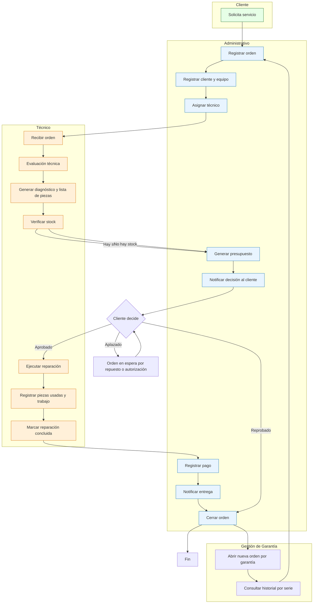

# Service Order Business Flow

This is the **single source of truth** for the service-order lifecycle at Digitron. Any code that drives stage transitions, role permissions, or UI actions must match this diagram. Update this document **before** changing implementation.

## Process Diagram

## Stage-to-Actor Mapping

| Stage (code)        | Owning actor      | Action                                        |
| ------------------- | ----------------- | --------------------------------------------- |
| `intake`            | administrativo    | Register order, assign technician             |
| `evaluation`        | tecnico           | Technical evaluation + parts diagnosis        |
| `budget`            | administrativo    | Generate budget, verify stock                 |
| `customer_decision` | administrativo    | Notify client; capture Approved/Deferred/Rejected |
| `on_hold`           | —                 | Waiting for part or client authorization      |
| `repair`            | tecnico           | Execute repair, log used parts + labor        |
| `payment`           | administrativo    | Register payment(s)                           |
| `delivered`         | administrativo    | Notify client of pickup                       |
| `closed`            | administrativo    | Close order; may open warranty order          |

## Decision Branches

| Decision   | Next stage   | Notes                                              |
| ---------- | ------------ | -------------------------------------------------- |
| Approved   | `repair`     | Budget authorized; technician starts work          |
| Deferred   | `on_hold`    | Waiting for part/auth; loops back to `customer_decision` |
| Rejected   | `closed`     | Order closed without repair                        |

## Warranty Path

After `closed`, administrativo may open a new order linked to the original via `warranty_origin_id`. The warranty flow uses the same stages starting from `intake`, with equipment history visible via serial-number lookup.

## Implementation Constraints

- `src/lib/state-machine.ts` — `STAGE_TRANSITIONS` and `STAGE_ACTOR_ROLES` must match the table above exactly.
- `src/lib/orders.functions.ts` — server-side transition guards enforce role + gate checks before any stage advance.
- RLS policies (`supabase/migrations/*_rls.sql`) encode read/write boundaries per role per stage.
- UI action buttons in `orders/$orderId.tsx` (`currentStepContent`) are gated by `canTransition` and must reflect the owning actor column above.
